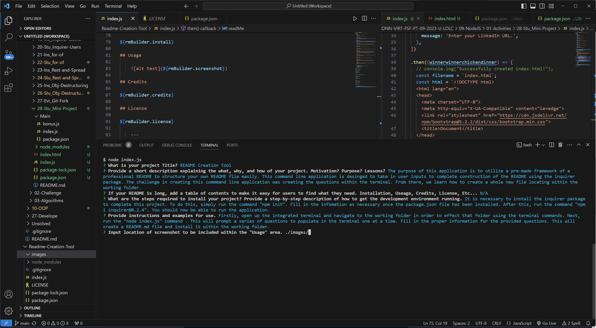

# README Creation Tool

## Description

The purpose of this application is to utilize a pre-made framework of a professional README to structure your own README file easily. This command line application is designed to take in user inputs to complete construction of the README using the inquirer package. The challenge in creating this command line application was creating the questions within the terminal. From there, we learn how to create a whole new file locating within the working folder.

## Table of Contents

N/A

## Installation

It is necessary to install the inquirer package to complete this project. To do this, simply run the command "npm init". Fill in the information as necessary once the package.json file has been installed. After this, run the command "npm i inquirer@8.2.4". You should now be able to run the application.

## Usage

    

## Credits

UCONN Full Stack Flex Coding Program - Instructor: Mia Ciasullo
UCONN Full Stack Flex Coding Program - Instructor: Lee Warrick

## License

MIT License. For more information on the associated license, please see the GitHub project repository.

## Features

N/A

## How to Contribute

N/A

## Tests

N/A